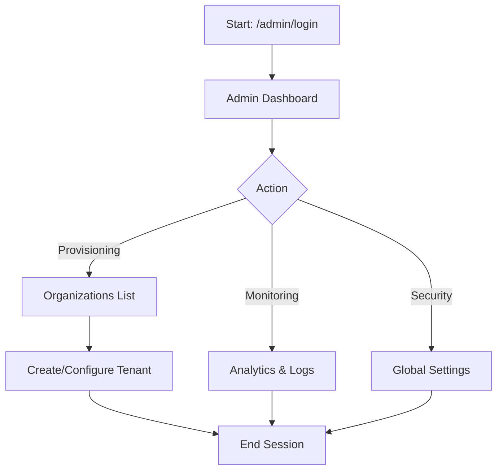
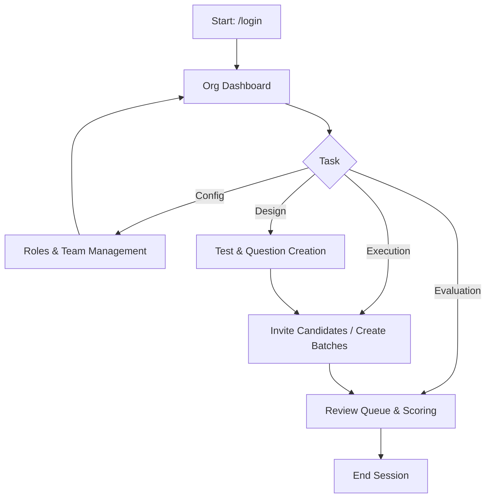
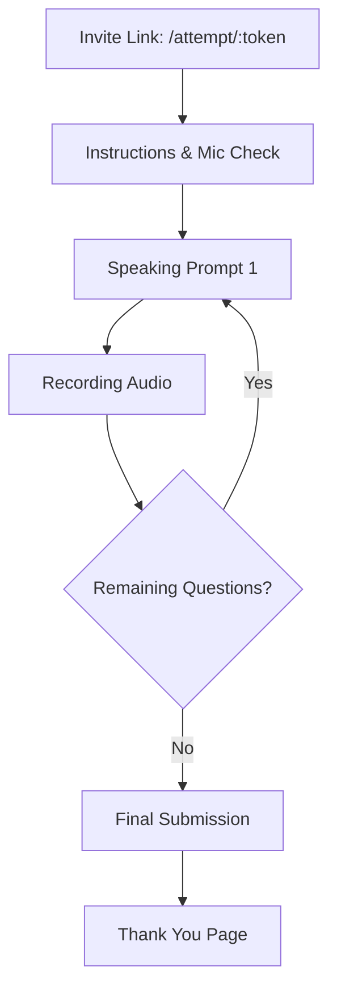

# SpeakScore User Flow Documentation

This document outlines the primary user journeys within the SpeakScore platform, categorized by user persona.

## 1. Super Admin Flow (Platform Management)

The Super Admin is responsible for high-level platform operations, including organization provisioning and system-wide monitoring.

### Core Journey
1.  **Authentication**: Secure login via `/admin/login`.
2.  **Dashboard**: Overview of platform health, total organizations, and active assessments.
3.  **Organization Provisioning**:
    *   Navigate to `/admin/orgs`.
    *   Initialize a new tenant (triggers schema creation and admin setup).
    *   Monitor organization status and credit allocation via `/admin/orgs/:id`.
4.  **Global Oversight**:
    *   **Analytics**: View platform-wide usage trends (`/admin/analytics`).
    *   **Audit Logs**: Monitor system-level security events (`/admin/logs`).
    *   **Security & Settings**: Manage platform-level configurations and security policies.

### Flow Diagram

---

## 2. Org Admin & Recruiter Flow (Assessment Lifecycle)

Organization stakeholders manage team members, design assessments, and evaluate candidates.

### Core Journey
1.  **Authentication**: Login via `/login`.
2.  **Setup (Admin Only)**:
    *   Configure custom roles and titles (`/org/roles`).
    *   Invite recruiters and team members (`/org/users`).
    *   Set up assessment templates (`/org/templates`).
3.  **Assessment Management**:
    *   Create or select a Test (`/tests`).
    *   Configure question sets for specific roles.
4.  **Candidate Engagement**:
    *   Invite candidates to a test via `/candidates`.
    *   Group candidates into batches for organized tracking (`/batches`).
5.  **Evaluation**:
    *   Monitor real-time progress of submissions.
    *   Review recordings and AI-generated scores in the **Review Queue** (`/review`).

### Flow Diagram

---

## 3. Candidate Flow (Assessment Experience)

Candidates interact with a streamlined, low-friction interface to submit their spoken responses.

### Core Journey
1.  **Entry**: Access via a secure, token-based link (`/attempt/:token`).
2.  **Onboarding**:
    *   View instructions and assessment expectations.
    *   Perform system checks (Browser compatibility, Microphone access).
3.  **Engagement**:
    *   Listen to/read the prompt.
    *   Record audio responses directly in the browser.
4.  **Completion**: Submit the assessment and receive confirmation.

### Flow Diagram

